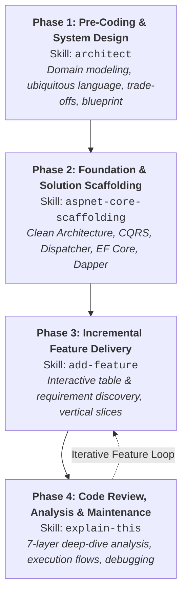

# 🚀 The 4-Phase Application Building Workflow

A complete, end-to-end engineering playbook for designing, scaffolding, extending, and reviewing enterprise-grade applications using AI Agent Skills (**Google Antigravity**, **Claude Code**, **Cursor**, **GitHub Copilot**, **Windsurf**, **Cline**, and more).

---

## 🧭 Overview & Lifecycle



---

## 🏛️ Phase 1 — Pre-Coding & System Design

### 🎯 Skill: [`architect`](./architect/SKILL.md)

### When to Use:
- Before writing any code for a new system or non-trivial capability.
- When domain boundaries, data models, or state transitions are ambiguous.
- When evaluating architectural trade-offs (e.g., synchronous vs. asynchronous, soft delete vs. state machine).

### What the Agent Does:
1. **Inspects Workspace Context**: Reviews existing documentation, schemas, and standards before asking questions.
2. **Aligns on Ubiquitous Language**: Identifies and defines 2–4 domain terms to ensure a shared mental model.
3. **Surfaces High-Impact Decisions**: Presents decisions with **opinionated recommendations and pros/cons** rather than open-ended questions.
4. **Delivers the Implementation Blueprint**: Produces an agreed blueprint with domain invariants and an ordered sequence of work.

### Example Prompts:
```text
"Act as an architect. I want to build a vehicle rental platform. Help me think through domain aggregates, invariants, and architectural trade-offs before we code."
```
```text
"Use the architect skill to help me plan a multi-tenant payment reconciliation engine."
```

---

## 🏗️ Phase 2 — Foundation & Solution Scaffolding

### 🎯 Skills:
- **Modular Monolith / Single Service**: [`aspnet-core-scaffolding`](./aspnet-core-scaffolding/SKILL.md)
- **Distributed Microservices**: [`scaffold-aspnet-microservices`](./scaffold-aspnet-microservices/SKILL.md)

### When to Use:
- When creating a brand-new repository or establishing the foundational architectural skeleton.
- When choosing between a modular Clean Architecture solution or a distributed Microservices system with YARP Gateway, SharedKernel, and Docker.
- When configuring solution-wide conventions, dependencies, and Central Package Management.

### What the Agent Does:
1. **Creates Architecture Layout**:
   * **Single Service / Modular Monolith (`aspnet-core-scaffolding`)**:
     - `Domain`: Aggregate roots, Result pattern primitives (`Result`, `Result<TValue>`, `Error`), repository contracts.
     - `Application`: In-process `IDispatcher` (no MediatR), CQRS abstractions (`ICommand`, `IQuery`), and FluentValidation.
     - `Infrastructure`: Dual-persistence (`DbContext` writes, Dapper reads), DB connection factory, DI registrations.
     - `Api`: Minimal API setup, routing, OpenAPI/Swagger, and RFC 7807 `ProblemDetails` error mapping.
   * **Distributed Microservices (`scaffold-aspnet-microservices`)**:
     - `Shared/SharedKernel`: Centralized CQRS, `IDispatcher`, `Result` pattern, domain base classes, and cross-cutting behaviors.
     - `Gateways/ApiGateway`: YARP reverse proxy, route clustering, rate limiting, and Swagger aggregation.
     - `Services/{ServiceName}`: Autonomous Clean Architecture per bounded context (`Domain`, `Application`, `Infrastructure`, `Api`) with database-per-service isolation.
     - `docker/`: Multi-stage `Dockerfile` per service/gateway and root `docker-compose.yml` with PostgreSQL, Redis, RabbitMQ (MassTransit), and health checks.
2. **Configures Central Package Management**: Creates `Directory.Packages.props` and `Directory.Build.props` to centralize NuGet package versions.
3. **Validates & Builds**: Ensures the solution compiles with zero warnings and passes initial architecture tests.

### Example Prompts:
```text
"Scaffold a new ASP.NET Core solution called VehicleRental using the standards in aspnet-core-scaffolding."
```
```text
"Use scaffold-aspnet-microservices to scaffold a new microservices solution called SupportlyAI with Tickets, Customers, and Knowledge services, YARP API Gateway, SharedKernel, and Docker Compose."
```

---

## ⚡ Phase 3 — Incremental Feature Delivery

### 🎯 Skill: [`add-feature`](./add-feature/SKILL.md)

### When to Use:
- When adding a new use case, command, query, database table, or aggregate module to an existing solution.
- When extending an existing feature slice with additional operations.

### What the Agent Does:
1. **Interactive Requirement Discovery**: Actively queries the user for missing details:
   - Target database table name & schema (e.g., `dbo.Bookings`).
   - Primary key strategy (`Guid`, `int`, etc.) and column definitions.
   - CQRS classification (Command vs. Query vs. Full Aggregate slice).
   - Domain invariants, validation constraints, and error codes (`*Errors.cs`).
   - Minimal API route path and HTTP method.
2. **Generates Complete Vertical Slice**:
   - **Domain**: Entity with invariant factory method, static domain errors, and repository interfaces.
   - **Application**: Feature folder (`Features/{Module}/{Commands|Queries}/{UseCase}`), Command/Query record, FluentValidation validator, and handler.
   - **Infrastructure**: EF Core `IEntityTypeConfiguration<T>` mapping, EF write repository, and Dapper read repository with parameterized SQL.
   - **API**: Minimal API endpoint with `TypedResults` and Result-to-ProblemDetails error mapping.
   - **Tests**: Unit tests for domain logic and application handlers.

### Example Prompts:
```text
"Add a feature to handle customer vehicle bookings. Ask me for the database table name, schema, and validation rules."
```
```text
"Add a CancelBooking command and endpoint to the existing Bookings feature slice."
```

---

## 🔬 Phase 4 — Code Review, Analysis & Maintenance

### 🎯 Skill: [`explain-this`](./explain-this/SKILL.md)

### When to Use:
- When reviewing pull requests, onboarding team members, or inspecting complex pipelines.
- When troubleshooting unexpected behavior, performance bottlenecks, or concurrency issues.

### What the Agent Does:
Delivers a structured, 7-layer deep-dive analysis:
1. **Executive Summary**: 1–2 plain English sentences on intent and purpose.
2. **Signature & Contract**: Inputs, outputs (`Result<T>`), and side effects.
3. **Step-by-Step Execution Walkthrough**: Chronological execution breakdown.
4. **Design Patterns & Idioms**: Result Pattern, CQRS/Dispatcher, DDD encapsulation, Unit of Work.
5. **Error Handling & Edge Cases**: Validation errors, domain errors, cancellation tokens, constraint violations.
6. **Performance & Concurrency**: Async I/O, Dapper parameterization, allocations, and database access.
7. **Practical Usage Example**: Clean caller snippet illustrating real-world invocation.

### Example Prompts:
```text
"Explain how this CreateRentalCommandHandler coordinates the domain aggregate, repository, and UnitOfWork."
```
```text
"Walk me through the Dispatcher routing pipeline and explain how handlers are dynamically resolved."
```

---

## 📊 Summary Reference Matrix

| Phase | Goal | Primary Skill | Core Artifacts Produced |
| :--- | :--- | :--- | :--- |
| **1. Design** | Align on vocabulary & resolve trade-offs | [`architect`](./architect/SKILL.md) | Architecture Blueprint & Decision Log |
| **2. Scaffold (Single Service)** | Build Clean Architecture foundation | [`aspnet-core-scaffolding`](./aspnet-core-scaffolding/SKILL.md) | Solution, Projects, Directory.Packages.props, Dispatcher, DbContext |
| **2. Scaffold (Microservices)** | Build Distributed Microservices system | [`scaffold-aspnet-microservices`](./scaffold-aspnet-microservices/SKILL.md) | SharedKernel, YARP ApiGateway, Microservices, Docker Compose |
| **3. Build** | Add vertical slice features incrementally | [`add-feature`](./add-feature/SKILL.md) | Entity, Command/Query, Validator, EF & Dapper Repos, Minimal API |
| **4. Review** | Understand, debug, and optimize code | [`explain-this`](./explain-this/SKILL.md) | 7-Section Technical Analysis Breakdown |
